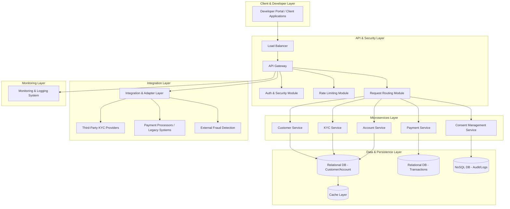
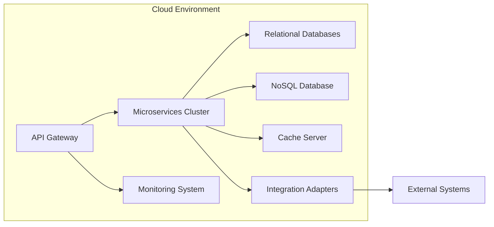
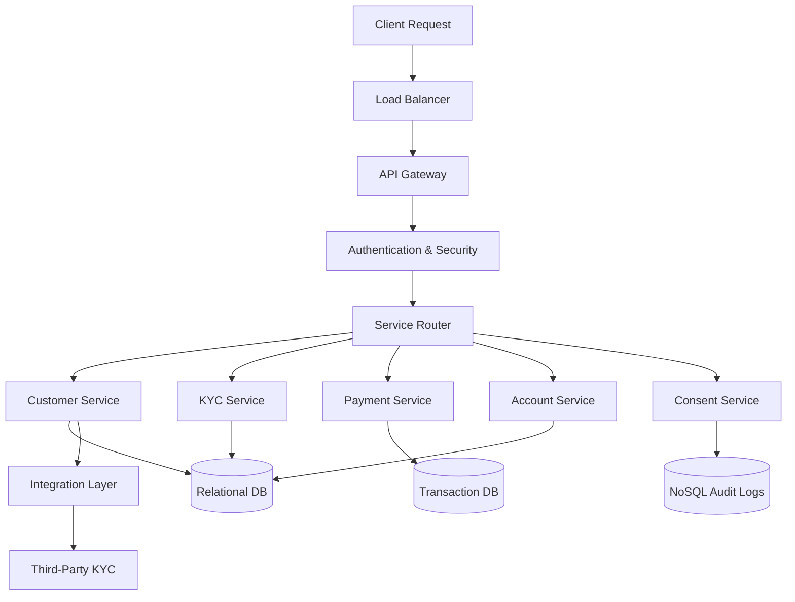
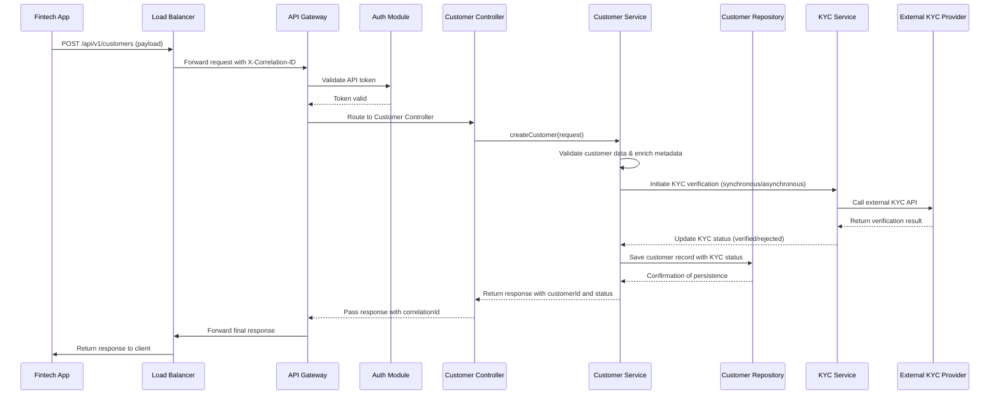
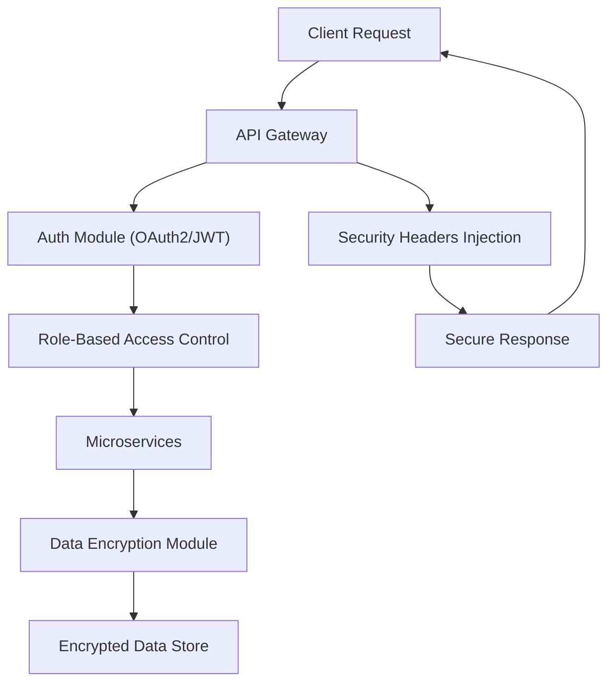

# High-Level Design (HLD) for Banking API Platform

**Version:** 1.0 
**Date:** 2025-03-24  
**Author:** Lokesh S

---

## 1. Introduction

### 1.1 Purpose
This HLD outlines the strategic architecture for a Banking API Platform that serves as a digital exchange for standardized financial services. It details how fintech companies integrate with core banking functions—such as customer onboarding, KYC, payments, account management, and consent handling—while ensuring robust security, scalability, and regulatory compliance.

### 1.2 Scope
This document covers:
- Architectural vision and guiding principles.
- Detailed system components and interactions.
- Data flow patterns and communication models.
- Non-functional requirements including performance, scalability, and security.
- High-level technology stack and integration with external systems.
- Diagrams for clarity and visual understanding.

---

## 2. Architectural Vision & Principles

### 2.1 Vision
Create an ecosystem that offers a secure, scalable, and standardized set of banking APIs accessible to fintech companies. The objective is to streamline integrations, reduce time-to-market, and deliver a consistent developer experience that complies with industry standards (e.g., BIAN) and regulatory mandates.

### 2.2 Key Principles
- **Modularity:** Use a microservices architecture where each service encapsulates a specific business function.
- **Interoperability & Standardization:** Design all APIs using RESTful practices and standard data models.
- **Security & Compliance:** Centralize security at the API Gateway and maintain comprehensive audit trails.
- **Scalability & Resilience:** Employ containerization and orchestration (e.g., Docker, Kubernetes) to enable auto-scaling, load balancing, and fault tolerance.
- **Observability:** Integrate centralized logging, monitoring, and alerting for high availability and rapid troubleshooting.

---

## 3. System Architecture Overview

The Banking API Platform is organized into multiple layers:

### 3.1 Layers & Components

- **Presentation Layer:**  
  - **Developer Portal & Client Applications:** Interfaces for fintech companies to interact with the platform.

- **API & Security Layer:**  
  - **Load Balancer:** Distributes incoming traffic evenly.
  - **API Gateway:** Acts as the secure entry point, handling authentication, rate limiting, and request routing.

- **Microservices Layer:**  
  - **Customer Service:** Manages customer registration and profile management.
  - **KYC Service:** Processes identity documents and communicates with external KYC providers.
  - **Payment Service:** Processes payment transactions and handles external integrations.
  - **Account Service:** Manages account data, balances, and transaction history.
  - **Consent Management Service:** Records and manages customer consents.

- **Data & Persistence Layer:**  
  - **Relational Databases:** Store structured data (e.g., customer profiles, account details, transactions).
  - **NoSQL Databases:** Handle unstructured data such as logs and audit trails.
  - **Caching Layer:** Improves performance for frequent read operations.

- **Integration & Adapter Layer:**  
  - Connects the platform to external systems such as third-party KYC providers, payment processors, legacy banking systems, and fraud detection services.

- **Monitoring & Logging Layer:**  
  - Provides centralized logging, performance monitoring, and compliance auditing.

---

## 4. Detailed Diagrams

### 4.1 Comprehensive Architecture Diagram

**Explanation:**  
- **Clients** access the system via the API Gateway, secured by load balancing and authentication modules.
- **Microservices** perform domain-specific tasks, persisting data in structured and unstructured databases.
- **Integration Layer** connects with external systems, while the **Monitoring Layer** ensures observability and compliance.

---

### 4.2 Deployment Diagram

**Explanation:**  
- **API Gateway** deployed at the edge of the cloud environment.
- **Microservices Cluster** runs containerized services on Kubernetes.
- **Data Components** (Relational DB, NoSQL DB, Cache) are provisioned in a managed cloud service.
- **Integration Adapters** manage outbound communications.
- **Monitoring System** tracks overall health and performance.

---

### 4.3 Data Flow Diagram

**Explanation:**  
- **Client Requests** flow from the Load Balancer to the API Gateway.
- **Authentication** is applied before routing to domain-specific microservices.
- **Data Storage** is utilized by microservices, and integration calls are managed by the adapter layer.

---

### 4.4 End-to-End Sequence Diagram (Customer Registration & KYC)

**Explanation:**  
- The sequence captures the flow from registration through KYC verification.
- Each step carries a unique correlation ID for traceability.
- The design supports both synchronous and asynchronous KYC verification based on external response times.

---

### 4.5 Security Diagram

**Explanation:**  
- **Authentication & Authorization:** API Gateway validates requests using OAuth2/JWT.
- **RBAC:** Enforces access controls before processing.
- **Encryption:** Data is encrypted both in transit (TLS/SSL) and at rest.
- **Security Headers:** Enhance protection against common web vulnerabilities.

---

## 5. Non-Functional Requirements (Extended)

### 5.1 Scalability & Performance
- **Horizontal Scaling:** Deploy microservices in a Kubernetes cluster to scale as needed.
- **Load Balancing & Caching:** Use load balancers and caching (e.g., Redis) to improve response times.
- **Monitoring:** Employ Prometheus and Grafana for real-time performance metrics.

### 5.2 Security & Compliance
- **Encryption:** Ensure all data transmissions use TLS/SSL and apply encryption at rest.
- **Access Control & Auditing:** Enforce strict RBAC and log all critical operations for compliance (GDPR, PCI-DSS).
- **Vulnerability Management:** Regularly update components and perform penetration testing.

### 5.3 Fault Tolerance & Disaster Recovery
- **Redundancy:** Run multiple instances across different availability zones.
- **Automated Backups:** Schedule frequent backups and establish a disaster recovery plan.
- **Resilience Patterns:** Implement circuit breakers, retries, and graceful degradation.

---

## 6. Summary and Next Steps

This updated HLD document provides a comprehensive architectural blueprint for the Banking API Platform. It includes enhanced component descriptions, detailed data flow and deployment diagrams, security considerations, and end-to-end sequence flows. Key next steps include:

1. **Stakeholder Review:** Share the HLD with relevant teams (development, security, operations).
2. **Prototyping:** Build proof-of-concepts for critical components like the API Gateway and KYC service.
3. **Iterative Refinement:** Gather feedback, perform testing, and refine the architecture.
4. **Transition to Detailed LLD:** Use this HLD as a guide to create or update the Low-Level Design documents and begin implementation.

---
