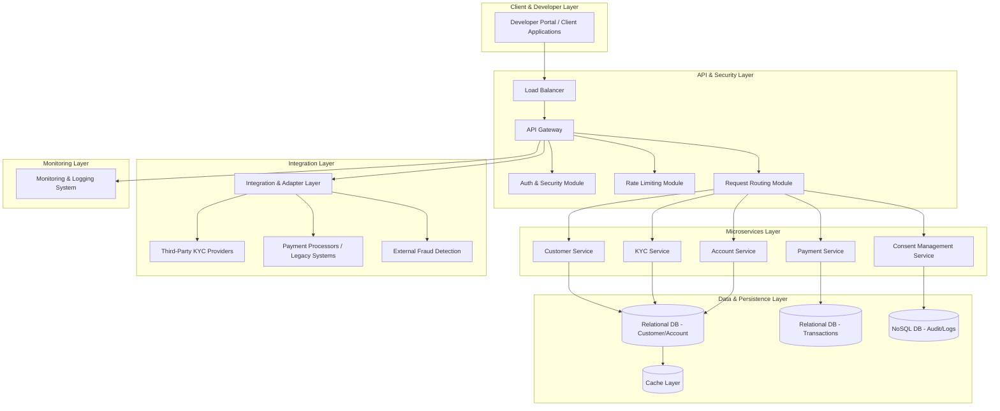
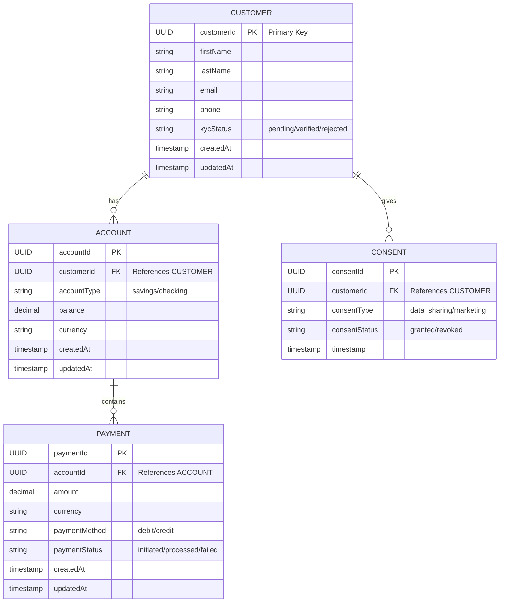
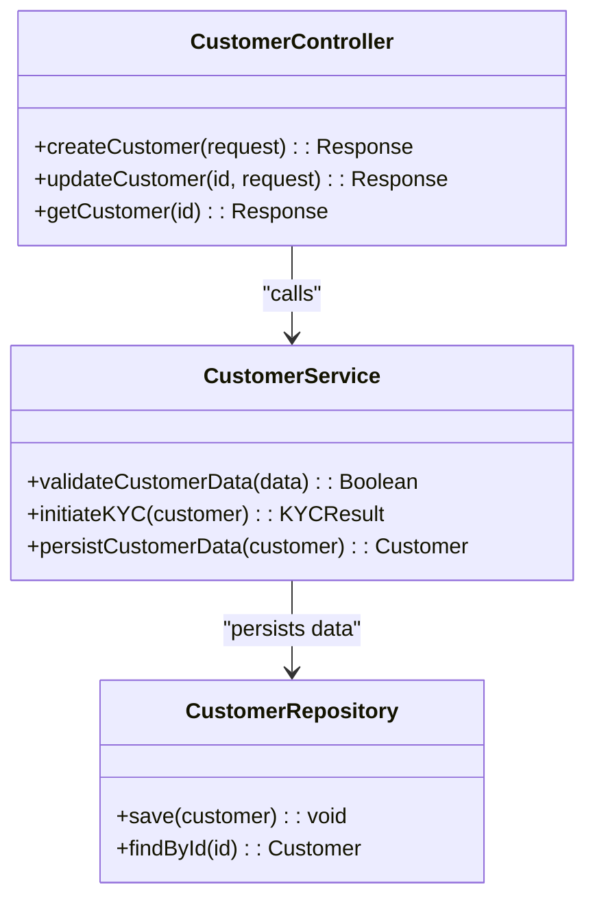
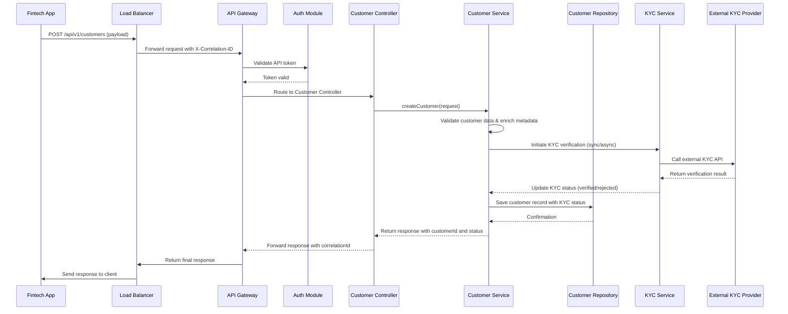
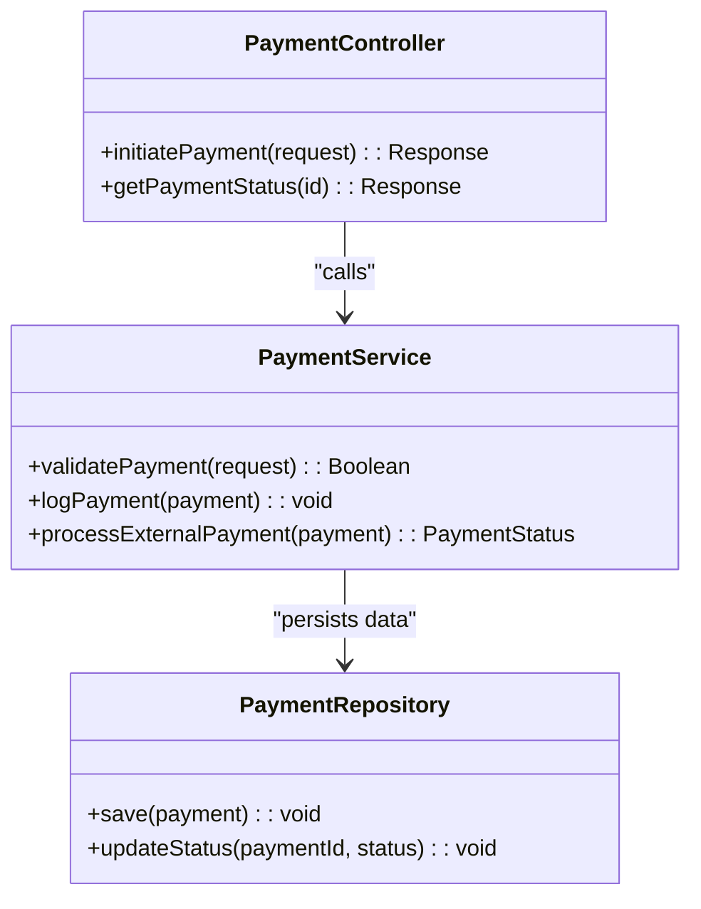
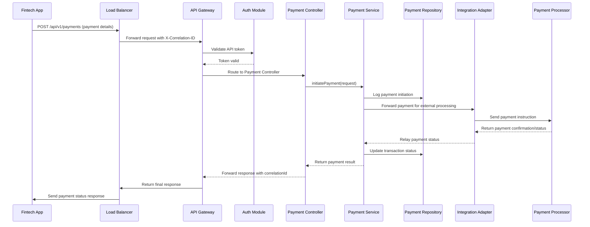

Below is the complete updated Low-Level Design (LLD) document for your Banking API Platform. This document integrates detailed specifications for endpoints (including all possible requests, responses, and errors), service layer designs with class and sequence diagrams, data models, error handling, security measures, integration adapter strategies, and deployment/infrastructure considerations.

---

# Updated Low-Level Design (LLD) for Banking API Platform

**Version:** 2.1  
**Date:** 2025-03-24  
**Author:** [Your Name/Team]

---

## Table of Contents

1. [Introduction](#1-introduction)  
2. [System Architecture Overview](#2-system-architecture-overview)  
3. [API Endpoints Detailed Design](#3-api-endpoints-detailed-design)  
   - 3.1 [Customer Onboarding & KYC](#31-customer-onboarding--kyc)  
   - 3.2 [Payment Processing](#32-payment-processing)  
   - 3.3 [Account Management & Consent](#33-account-management--consent)  
4. [Data Model and Database Design](#4-data-model-and-database-design)  
5. [Service Layer Design](#5-service-layer-design)  
   - 5.1 [Customer Service](#51-customer-service)  
   - 5.2 [Payment Service](#52-payment-service)  
   - 5.3 [KYC, Account, and Consent Services](#53-kyc-account-and-consent-services)  
6. [Error Handling and Logging](#6-error-handling-and-logging)  
7. [Security Implementation Details](#7-security-implementation-details)  
8. [Integration Adapters & External Systems](#8-integration-adapters--external-systems)  
9. [Deployment and Infrastructure Considerations](#9-deployment-and-infrastructure-considerations)  
10. [API Documentation, Versioning, and Developer Portal](#10-api-documentation-versioning-and-developer-portal)  
11. [Summary and Next Steps](#11-summary-and-next-steps)  
12. [Appendix and References](#12-appendix-and-references)

---

## 1. Introduction

### 1.1 Purpose
This document provides a comprehensive technical blueprint for implementing the Banking API Platform. It defines every aspect of the system including detailed API specifications, data models, service class designs, error handling strategies, security, integration adapters, and deployment configurations. The platform aims to deliver standardized and secure banking services (e.g., customer onboarding, KYC, payments, account management, consent management) for fintech companies.

### 1.2 Scope
- **Functional Components:**  
  - Customer onboarding and KYC verification  
  - Payment processing  
  - Account management  
  - Consent management  
- **Non-Functional Requirements:**  
  - Performance, scalability, security, logging, error handling, and regulatory compliance  
- **Audience:**  
  Software architects, developers, QA engineers, and DevOps teams.

### 1.3 Assumptions & Constraints
- RESTful APIs using JSON payloads.  
- Cloud-based deployment using container orchestration (e.g., Kubernetes).  
- Integration with external systems via secure REST or SOAP protocols.  
- Compliance with industry standards (e.g., BIAN) and regulations (GDPR, PCI-DSS).

---

## 2. System Architecture Overview

The platform is designed as a set of containerized microservices with clearly defined responsibilities, operating behind an API Gateway that handles security, routing, and monitoring.

### 2.1 Architectural Layers

- **Presentation Layer:**  
  Developer Portal and Client Applications interface with the platform.

- **API & Security Layer:**  
  Load Balancer and API Gateway enforce authentication, rate limiting, and security header injection.

- **Microservices Layer:**  
  Independent services such as Customer, KYC, Payment, Account, and Consent Management.

- **Data & Persistence Layer:**  
  Relational databases store structured data (customers, accounts, transactions) while NoSQL databases capture logs and audit trails; a caching layer boosts performance.

- **Integration & Adapter Layer:**  
  Manages communication with external systems like KYC providers and payment processors.

- **Monitoring & Logging Layer:**  
  Centralized systems (e.g., Prometheus, Grafana, ELK) ensure observability and compliance.

### 2.2 Detailed Architecture Diagram



**Explanation:**  
- Clients access the system via the API Gateway, which verifies requests and routes them to the correct microservices.  
- Each microservice stores its data in the appropriate database (relational for structured data, NoSQL for logs).  
- Integration adapters facilitate external communications, while the monitoring layer aggregates logs and performance metrics.

---

## 3. API Endpoints Detailed Design

Each endpoint includes full details on HTTP methods, URLs, headers, request payloads, successful responses, and error responses.

### 3.1 Customer Onboarding & KYC

#### 3.1.1 Customer Registration Endpoint

- **HTTP Method:** POST  
- **URL:** `/api/v1/customers`  
- **Description:** Registers a new customer and triggers KYC verification.

**Required Headers:**
- `Authorization`: Bearer token (e.g., `Bearer eyJhbGciOiJIUzI1Ni...`)
- `Content-Type`: `application/json`
- `X-Correlation-ID`: Unique identifier (e.g., `abc123xyz`)

**Request Payload Example:**

```json
{
  "firstName": "Alice",
  "lastName": "Doe",
  "email": "alice.doe@example.com",
  "phone": "+1234567890",
  "address": {
    "street": "123 Main St",
    "city": "Metropolis",
    "state": "NY",
    "postalCode": "10001",
    "country": "USA"
  },
  "kycDocument": "base64EncodedDocument",
  "metadata": {
    "source": "mobile_app",
    "referralCode": "REF1234"
  }
}
```

**Successful Response (HTTP 201 Created):**

```json
{
  "customerId": "123e4567-e89b-12d3-a456-426614174000",
  "status": "pending",
  "message": "Customer registered successfully, pending KYC verification.",
  "timestamp": "2025-03-24T15:30:00Z",
  "correlationId": "abc123xyz"
}
```

**Error Responses:**

- **400 Bad Request:**

  ```json
  {
    "errorCode": "ERR_INVALID_INPUT",
    "message": "Email is required and must be a valid email address.",
    "timestamp": "2025-03-24T15:32:00Z",
    "correlationId": "abc123xyz"
  }
  ```

- **401 Unauthorized:**

  ```json
  {
    "errorCode": "ERR_UNAUTHORIZED",
    "message": "API token is missing or invalid.",
    "timestamp": "2025-03-24T15:33:00Z",
    "correlationId": "abc123xyz"
  }
  ```

- **409 Conflict:**

  ```json
  {
    "errorCode": "ERR_DUPLICATE_CUSTOMER",
    "message": "A customer with this email already exists.",
    "timestamp": "2025-03-24T15:34:00Z",
    "correlationId": "abc123xyz"
  }
  ```

- **500 Internal Server Error:**

  ```json
  {
    "errorCode": "ERR_SERVER",
    "message": "An unexpected error occurred. Please try again later.",
    "timestamp": "2025-03-24T15:35:00Z",
    "correlationId": "abc123xyz"
  }
  ```

---

#### 3.1.2 KYC Verification Endpoint

- **HTTP Method:** POST  
- **URL:** `/api/v1/kyc`  
- **Description:** Submits customer documents for KYC verification.

**Required Headers:**
- `Authorization`
- `Content-Type`: `application/json`
- `X-Correlation-ID`

**Request Payload Example:**

```json
{
  "customerId": "123e4567-e89b-12d3-a456-426614174000",
  "documentType": "passport",
  "documentData": "base64EncodedData",
  "documentExpiry": "2030-12-31",
  "metadata": {
    "submissionChannel": "web_portal"
  }
}
```

**Successful Response (HTTP 200 OK):**

```json
{
  "customerId": "123e4567-e89b-12d3-a456-426614174000",
  "kycStatus": "verified",
  "verificationDate": "2025-03-24T15:30:00Z",
  "correlationId": "def456uvw"
}
```

**Error Responses:**

- **400 Bad Request:**

  ```json
  {
    "errorCode": "ERR_INVALID_INPUT",
    "message": "Document data is missing or improperly formatted.",
    "timestamp": "2025-03-24T15:40:00Z",
    "correlationId": "def456uvw"
  }
  ```

- **401 Unauthorized:**

  ```json
  {
    "errorCode": "ERR_UNAUTHORIZED",
    "message": "API token is missing or invalid.",
    "timestamp": "2025-03-24T15:41:00Z",
    "correlationId": "def456uvw"
  }
  ```

- **404 Not Found:**

  ```json
  {
    "errorCode": "ERR_NOT_FOUND",
    "message": "Customer ID not found.",
    "timestamp": "2025-03-24T15:42:00Z",
    "correlationId": "def456uvw"
  }
  ```

- **422 Unprocessable Entity:**

  ```json
  {
    "errorCode": "ERR_INVALID_DOCUMENT",
    "message": "The provided document is expired or of an unsupported type.",
    "timestamp": "2025-03-24T15:43:00Z",
    "correlationId": "def456uvw"
  }
  ```

- **500 Internal Server Error:**

  ```json
  {
    "errorCode": "ERR_SERVER",
    "message": "An unexpected error occurred during KYC verification.",
    "timestamp": "2025-03-24T15:44:00Z",
    "correlationId": "def456uvw"
  }
  ```

---

### 3.2 Payment Processing

#### 3.2.1 Payment Initiation Endpoint

- **HTTP Method:** POST  
- **URL:** `/api/v1/payments`  
- **Description:** Initiates a payment transaction.

**Required Headers:**
- `Authorization`
- `Content-Type`: `application/json`
- `X-Correlation-ID`

**Request Payload Example:**

```json
{
  "accountId": "acc-001",
  "amount": 250.75,
  "currency": "USD",
  "paymentMethod": "debit",
  "paymentDetails": {
    "merchantId": "merch-123",
    "referenceNumber": "INV-20250324-001"
  },
  "metadata": {
    "channel": "mobile_app",
    "transactionType": "purchase"
  }
}
```

**Successful Response (HTTP 200 OK or 201 Created):**

```json
{
  "paymentId": "pay-789",
  "paymentStatus": "initiated",
  "message": "Payment is being processed.",
  "timestamp": "2025-03-24T15:35:00Z",
  "correlationId": "ghi789rst"
}
```

**Error Responses:**

- **400 Bad Request:**

  ```json
  {
    "errorCode": "ERR_INVALID_INPUT",
    "message": "Payment amount must be a positive number and currency is required.",
    "timestamp": "2025-03-24T15:37:00Z",
    "correlationId": "ghi789rst"
  }
  ```

- **401 Unauthorized:**

  ```json
  {
    "errorCode": "ERR_UNAUTHORIZED",
    "message": "Invalid or missing API token.",
    "timestamp": "2025-03-24T15:38:00Z",
    "correlationId": "ghi789rst"
  }
  ```

- **409 Conflict:**

  ```json
  {
    "errorCode": "ERR_DUPLICATE_TRANSACTION",
    "message": "A payment with the provided reference number has already been processed.",
    "timestamp": "2025-03-24T15:39:00Z",
    "correlationId": "ghi789rst"
  }
  ```

- **402 Payment Required:**

  ```json
  {
    "errorCode": "ERR_INSUFFICIENT_FUNDS",
    "message": "Insufficient funds in the account.",
    "timestamp": "2025-03-24T15:40:00Z",
    "correlationId": "ghi789rst"
  }
  ```

- **500 Internal Server Error:**

  ```json
  {
    "errorCode": "ERR_SERVER",
    "message": "An unexpected error occurred while processing the payment.",
    "timestamp": "2025-03-24T15:41:00Z",
    "correlationId": "ghi789rst"
  }
  ```

---

### 3.3 Account Management & Consent

#### 3.3.1 Account Information Retrieval Endpoint

- **HTTP Method:** GET  
- **URL:** `/api/v1/accounts/{accountId}`  
- **Description:** Retrieves details for a specific account.

**Required Headers:**
- `Authorization`
- `X-Correlation-ID`

**Optional Query Parameters:**
- `includeTransactions`: Boolean (if `true`, include recent transactions)
- `limit`: Integer (max transactions to return)
- `offset`: Integer (pagination offset)

**Successful Response (HTTP 200 OK):**

```json
{
  "accountId": "acc-001",
  "customerId": "123e4567-e89b-12d3-a456-426614174000",
  "accountType": "savings",
  "balance": 1024.50,
  "currency": "USD",
  "createdAt": "2025-03-01T12:00:00Z",
  "transactions": [
    {
      "transactionId": "txn-1001",
      "amount": 100.00,
      "type": "credit",
      "date": "2025-03-23T10:00:00Z"
    },
    {
      "transactionId": "txn-1002",
      "amount": 50.00,
      "type": "debit",
      "date": "2025-03-24T09:30:00Z"
    }
  ],
  "correlationId": "jkl012mno"
}
```

**Error Responses:**

- **400 Bad Request:**

  ```json
  {
    "errorCode": "ERR_INVALID_INPUT",
    "message": "Limit and offset parameters must be positive integers.",
    "timestamp": "2025-03-24T15:45:00Z",
    "correlationId": "jkl012mno"
  }
  ```

- **401 Unauthorized:**

  ```json
  {
    "errorCode": "ERR_UNAUTHORIZED",
    "message": "Invalid API token.",
    "timestamp": "2025-03-24T15:46:00Z",
    "correlationId": "jkl012mno"
  }
  ```

- **404 Not Found:**

  ```json
  {
    "errorCode": "ERR_NOT_FOUND",
    "message": "Account with the specified ID not found.",
    "timestamp": "2025-03-24T15:47:00Z",
    "correlationId": "jkl012mno"
  }
  ```

- **500 Internal Server Error:**

  ```json
  {
    "errorCode": "ERR_SERVER",
    "message": "An unexpected error occurred while retrieving account information.",
    "timestamp": "2025-03-24T15:48:00Z",
    "correlationId": "jkl012mno"
  }
  ```

---

#### 3.3.2 Consent Management Endpoint

- **HTTP Method:** POST  
- **URL:** `/api/v1/consents`  
- **Description:** Records a customer's consent for data sharing or marketing.

**Required Headers:**
- `Authorization`
- `Content-Type`: `application/json`
- `X-Correlation-ID`

**Request Payload Example:**

```json
{
  "customerId": "123e4567-e89b-12d3-a456-426614174000",
  "consentType": "data_sharing",
  "consentStatus": "granted",
  "metadata": {
    "ipAddress": "192.168.1.10",
    "userAgent": "Mozilla/5.0 (compatible; MyApp/1.0)"
  }
}
```

**Successful Response (HTTP 201 Created):**

```json
{
  "consentId": "cons-456",
  "customerId": "123e4567-e89b-12d3-a456-426614174000",
  "consentStatus": "granted",
  "timestamp": "2025-03-24T15:45:00Z",
  "correlationId": "pqr345stu"
}
```

**Error Responses:**

- **400 Bad Request:**

  ```json
  {
    "errorCode": "ERR_INVALID_INPUT",
    "message": "Consent type and status are required.",
    "timestamp": "2025-03-24T15:47:00Z",
    "correlationId": "pqr345stu"
  }
  ```

- **401 Unauthorized:**

  ```json
  {
    "errorCode": "ERR_UNAUTHORIZED",
    "message": "API token is missing or invalid.",
    "timestamp": "2025-03-24T15:48:00Z",
    "correlationId": "pqr345stu"
  }
  ```

- **409 Conflict:**

  ```json
  {
    "errorCode": "ERR_CONFLICT",
    "message": "Consent already recorded for this customer and type.",
    "timestamp": "2025-03-24T15:49:00Z",
    "correlationId": "pqr345stu"
  }
  ```

- **500 Internal Server Error:**

  ```json
  {
    "errorCode": "ERR_SERVER",
    "message": "An unexpected error occurred while recording consent.",
    "timestamp": "2025-03-24T15:50:00Z",
    "correlationId": "pqr345stu"
  }
  ```

---

## 4. Data Model and Database Design

### 4.1 Entity Relationship Diagram (ERD)



### 4.2 Database Considerations

- **Indexes:**  
  - Index `customerId` in ACCOUNT and CONSENT tables.  
  - Composite indexes on PAYMENT (`accountId`, `createdAt`).
- **Normalization:**  
  - Use normalized schemas to reduce redundancy while ensuring performance.
- **Encryption:**  
  - Use Transparent Data Encryption (TDE) for sensitive data and secure backup procedures.

---

## 5. Service Layer Design

Each microservice is designed using Domain-Driven Design principles and follows the Repository Pattern.

### 5.1 Customer Service

**Responsibilities:**
- Validate and process customer data.
- Initiate KYC verification.
- Persist customer records.

**Class Diagram:**



**Sequence Diagram for Customer Registration:**



---

### 5.2 Payment Service

**Responsibilities:**
- Validate payment requests.
- Log and process payments.
- Update payment status.

**Class Diagram:**



**Sequence Diagram for Payment Processing:**



---

### 5.3 KYC, Account, and Consent Services

- **KYC Service:**  
  - Handles document validation, asynchronous processing, and integration with external KYC APIs.
  - Follows similar class and sequence patterns as the Customer Service.
  
- **Account Service:**  
  - Manages account retrieval, updates, and supports pagination for transaction history.
  - Utilizes repositories for database access and validation.
  
- **Consent Management Service:**  
  - Records customer consents, maintains audit logs, and supports versioning.
  - Provides PATCH endpoints for updating or revoking consents.

---

## 6. Error Handling and Logging

### 6.1 Error Handling Strategy

**General Error Response Structure:**

```json
{
  "errorCode": "ERR_CODE",
  "message": "Error message here.",
  "timestamp": "2025-03-24T15:XX:00Z",
  "correlationId": "unique-id"
}
```

- **400 Bad Request:**  
  For missing/invalid inputs.
- **401 Unauthorized:**  
  For missing/invalid API tokens.
- **404 Not Found:**  
  When a resource (customer, account, etc.) does not exist.
- **409 Conflict:**  
  For duplicate resource creation.
- **422 Unprocessable Entity:**  
  For invalid document data or unacceptable state transitions.
- **500 Internal Server Error:**  
  For unexpected errors.

_Examples provided in the endpoint specifications above._

### 6.2 Logging Strategy

- **Structured Logging:**  
  Use logging frameworks to produce JSON logs with timestamp, correlationId, service name, and error details.
- **Audit Logging:**  
  Log critical operations (e.g., KYC updates, payment changes) to an immutable NoSQL store.
- **Correlation IDs:**  
  All logs include a unique `X-Correlation-ID` for end-to-end tracing.

---

## 7. Security Implementation Details

### 7.1 API Gateway Security

- **Authentication & Authorization:**  
  Validate OAuth2/JWT tokens; enforce RBAC.
- **Encryption:**  
  Use TLS/SSL for all communications; encrypt sensitive data at rest.
- **Security Headers:**  
  Automatically inject headers like `X-Content-Type-Options`, `X-Frame-Options`, and `Strict-Transport-Security`.

### 7.2 Service-Level Security

- **Middleware:**  
  Implement token validation and access controls in each microservice.
- **Access Policies:**  
  Define granular permissions for sensitive endpoints (e.g., initiating payments or updating KYC).

---

## 8. Integration Adapters & External Systems

### 8.1 Integration Adapter Layer

- **Responsibilities:**  
  Convert internal data formats to external API formats; manage protocol translation; implement retry, timeout, and circuit breaker mechanisms.
- **Design:**  
  Use dedicated client modules for each external system.

### 8.2 External Integrations

- **KYC Providers:**  
  Secure REST calls with appropriate authentication and fallback strategies.
- **Payment Processors:**  
  Use asynchronous messaging for payment instructions; support callback mechanisms.
- **Legacy Systems & Fraud Detection:**  
  Use protocol adapters and transformation services.

---

## 9. Deployment and Infrastructure Considerations

### 9.1 Containerization and Orchestration

- **Containers:**  
  Package each microservice as a Docker container.
- **Orchestration:**  
  Deploy on Kubernetes for auto-scaling, service discovery, and self-healing.

### 9.2 Infrastructure Components

- **Load Balancers:**  
  Distribute incoming traffic to the API Gateway.
- **CI/CD Pipelines:**  
  Automate testing, builds, and deployments using tools like Jenkins or GitLab CI.
- **Environment Separation:**  
  Maintain distinct environments for development, staging, and production.

---

## 10. API Documentation, Versioning, and Developer Portal

### 10.1 API Documentation

- **Swagger/OpenAPI:**  
  Generate comprehensive documentation with examples, error codes, and detailed schemas.
- **Versioning:**  
  Embed version numbers in URLs (e.g., `/api/v1/`) to manage backward compatibility.

### 10.2 Developer Portal

- **Self-Service Registration:**  
  Enable developers to register and obtain API keys.
- **Interactive Documentation:**  
  Provide a Swagger UI for live testing of APIs.
- **SDKs and Code Samples:**  
  Supply language-specific SDKs and sample code for easier integration.

---

## 11. Summary and Next Steps

This updated Low-Level Design document provides a detailed blueprint for your Banking API Platform, covering all aspects from API endpoint specifications (including all possible requests, responses, and errors) to service layer designs, data models, security, integration adapters, and deployment strategies.

**Next Steps:**
1. **Stakeholder Review:** Validate the design with development, security, and operations teams.
2. **Prototype Critical Components:** Build proof-of-concepts for the API Gateway, Customer/KYC services, and external integrations.
3. **Refinement:** Iterate based on testing, feedback, and performance metrics.
4. **Transition to Implementation:** Use this LLD as the basis for coding, testing, and eventual deployment.

---

## 12. Appendix and References

- **Glossary:**  
  Definitions for key terms such as KYC, API Gateway, RBAC, etc.
- **Reference Documents:**  
  Links to BIAN standards, OAuth2 specifications, and database best practices.
- **Team Contacts:**  
  Contact details for the architecture and support teams.

---
