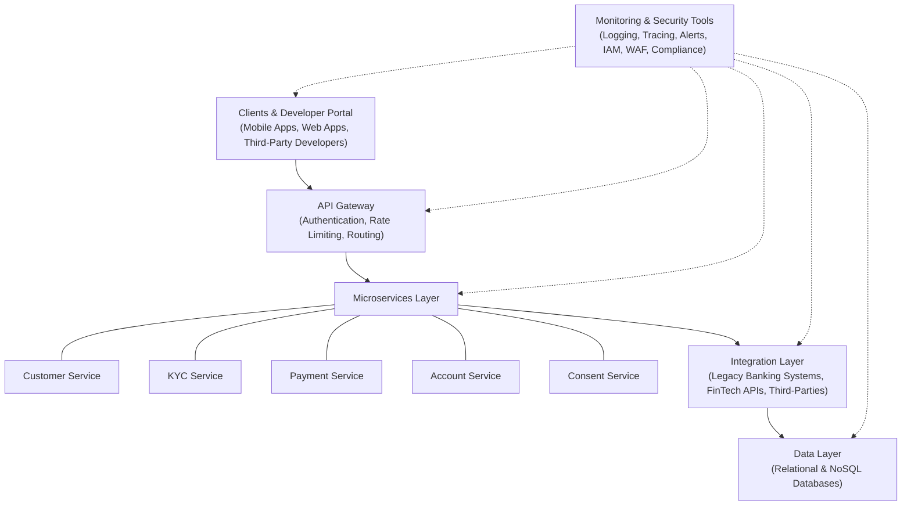

## System Architecture

### 1. Architectural Overview

The platform is designed as a layered, microservices-based ecosystem that connects fintech companies with core banking functionalities through standardized APIs. The architecture is modular, ensuring that each component can be independently developed, deployed, and scaled. Key layers include:

- **Presentation Layer:**  
  - **Developer Portal:** An interactive interface for developers to access API documentation, testing sandboxes, and obtain API keys.
  - **Client Applications:** Fintech solutions that consume the APIs for onboarding, payments, KYC, and account management.

- **API Gateway:**  
  - Serves as the secure entry point for all incoming requests.
  - Handles authentication, authorization, rate limiting, request routing, and logging.

- **Microservices Layer:**  
  - A collection of independently deployable services, each responsible for a specific banking function (e.g., Customer Onboarding, KYC, Payments, Account Management, Consent Management).
  - Each service maintains its own domain logic and data storage where necessary.

- **Integration & Adapter Layer:**  
  - Facilitates communication between the internal microservices and external systems such as legacy banking platforms, third-party KYC providers, or payment processors.
  - Implements format conversion and data transformation services to ensure interoperability.

- **Data Layer:**  
  - Centralized databases for storing customer data, transactions, audit logs, and consent records.
  - Employs both relational and NoSQL databases, along with caching mechanisms to optimize performance.

- **Monitoring, Logging & Compliance Layer:**  
  - Centralized logging and monitoring systems that track API usage, performance metrics, security events, and audit trails.
  - Supports regulatory compliance by ensuring traceability and detailed reporting.

---

### 2. Key Architectural Components

#### 2.1 API Gateway
- **Responsibilities:**
  - **Authentication & Authorization:** Implements OAuth2, JWT, and role-based access control to secure API endpoints.
  - **Request Routing:** Directs incoming requests to the appropriate microservice based on URL, headers, or other metadata.
  - **Rate Limiting & Throttling:** Protects backend services from excessive load or potential abuse.
  - **Logging & Monitoring:** Captures detailed logs and performance metrics for each request, providing a single point for observability.

#### 2.2 Microservices Layer
Each microservice encapsulates a distinct business domain:
- **Customer & KYC Service:**  
  - Handles customer registration, onboarding, and KYC verification.
  - Integrates with third-party identity verification services.
- **Payment Service:**  
  - Manages payment initiation, processing, status tracking, and reconciliation.
  - Supports various payment channels and methods.
- **Account Service:**  
  - Manages account creation, balance inquiries, transaction history, and account updates.
- **Consent Management Service:**  
  - Captures and manages user consents.
  - Provides audit trails and compliance reporting.
  
*Each microservice communicates using RESTful APIs (with JSON payloads) and leverages asynchronous messaging (e.g., message queues) for event-driven operations, ensuring loose coupling and responsiveness.*

#### 2.3 Integration & Adapter Layer
- **Adapters for External Systems:**  
  - Bridge communication with legacy core banking systems and third-party service providers.
  - Handle format conversion (e.g., XML to JSON) and protocol translation as needed.
- **Data Transformation Services:**  
  - Normalize data from various sources to match the internal data models and BIAN standards.

#### 2.4 Data Layer
- **Databases:**  
  - **Relational Databases:** For structured data such as customer records, transaction histories, and account information.
  - **NoSQL Databases:** For handling unstructured or semi-structured data, like logs and session data.
- **Caching Mechanisms:**  
  - Utilized to improve response times for frequently accessed data.
- **Data Security:**  
  - All data is encrypted at rest and in transit, with strict access controls in place.

#### 2.5 Developer Portal & Documentation
- **Interactive Documentation:**  
  - Provides comprehensive, interactive API documentation (Swagger/OpenAPI) that developers can use to test and integrate APIs.
- **Self-Service Features:**  
  - Includes API key management, sandbox environments for testing, and community support features.

#### 2.6 Monitoring, Logging & Compliance
- **Centralized Logging:**  
  - Aggregates logs from all components to enable real-time monitoring, troubleshooting, and forensic analysis.
- **Performance Monitoring:**  
  - Tools and dashboards track key performance indicators (KPIs) such as API latency, throughput, error rates, and system health.
- **Compliance & Audit Trails:**  
  - Detailed audit logs that capture every interaction, aiding in regulatory compliance (e.g., GDPR, PCI-DSS) and internal audits.

---

### 3. Data Flow and Communication

1. **Client Request Flow:**
   - A fintech application sends an API request (e.g., customer registration) to the **API Gateway**.
   - The gateway authenticates the request, applies rate limiting, logs the interaction, and then routes it to the appropriate microservice (e.g., Customer Service).

2. **Internal Service Interaction:**
   - The **Customer Service** processes the registration request, interacts with the **KYC Service** for identity verification, and may communicate with the **Data Layer** to persist the new customer data.
   - If external verification is required, the **Integration Layer** converts the request and forwards it to the third-party KYC provider, then processes the response back into the internal format.

3. **Response and Logging:**
   - Once processing is complete, the microservice returns a response to the API Gateway, which in turn sends it back to the client.
   - All steps are logged and monitored to ensure traceability and to enable rapid diagnosis in case of failures.

4. **Asynchronous Processes:**
   - For operations like payment processing or batch reconciliation, asynchronous messaging systems (e.g., message queues) ensure that tasks are processed in the background without delaying the client response.

---

### 4. Scalability, Performance, and Security Considerations

- **Containerization & Orchestration:**  
  - Utilize containerization (e.g., Docker) and orchestration platforms (e.g., Kubernetes) to deploy microservices independently, enabling auto-scaling and simplified maintenance.
- **Fault Tolerance:**  
  - Deploy multiple instances of each microservice behind load balancers, with redundancy built into each layer to handle failures gracefully.
- **Security Best Practices:**  
  - Employ end-to-end encryption, secure token management, and regular security audits.
  - Implement robust logging and intrusion detection systems to monitor and mitigate security threats.

---

### 5. Technology Stack Considerations

While the exact technology stack may vary depending on organizational preferences and existing infrastructure, consider the following:

- **API Gateway:** Tools like Kong, Apigee, or AWS API Gateway.
- **Microservices Framework:** Spring Boot (Java), Express.js (Node.js), or .NET Core.
- **Databases:** PostgreSQL/MySQL for relational data, MongoDB/Cassandra for NoSQL requirements.
- **Messaging System:** Apache Kafka, RabbitMQ, or similar.
- **Containerization & Orchestration:** Docker and Kubernetes.
- **Monitoring & Logging:** Prometheus, Grafana, ELK/EFK stack, or Splunk.

---

### 6. Diagrammatic Representation 

---
